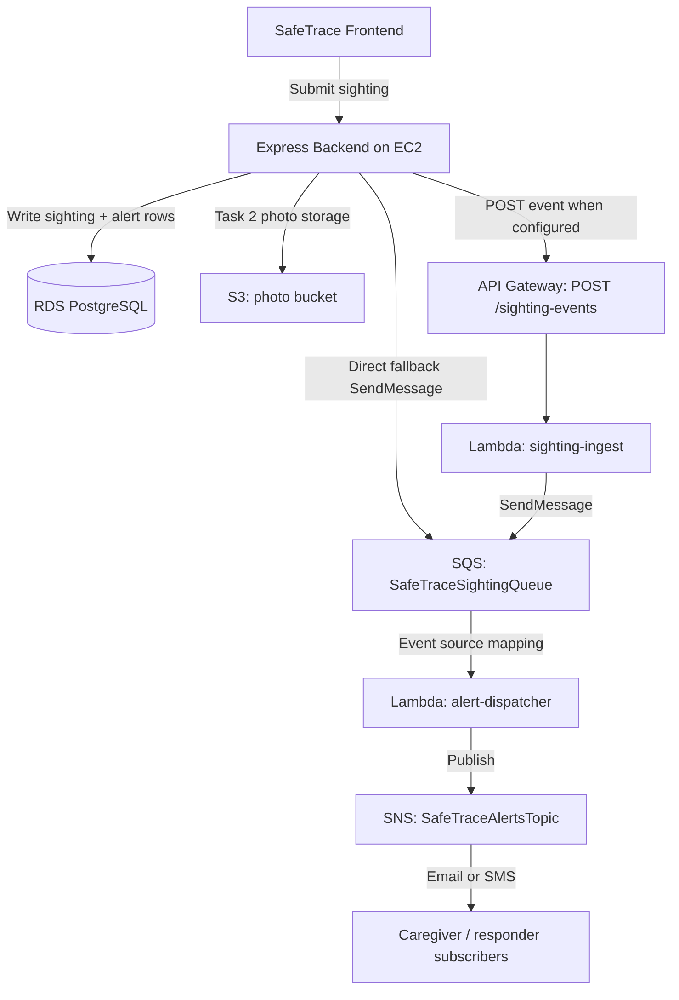

# STEP 5 - Serverless Integration and Architecture (Task 2)

Task 2 is a separate serverless extension added after the Task 1 EC2/RDS server app is working. The main web application remains server-based on EC2; Task 2 only offloads photo storage and alert-event processing into cloud services.

Task 2 event flow:



The Lambda source code lives in `lambdas/sighting-ingest` and `lambdas/alert-dispatcher`. These Lambdas are not replacements for the EC2 backend; they are supporting microservices for the alert pipeline.

Last reviewed: 2026-05-28

## 1. SQS Queue

Create an SQS standard queue, for example `SafeTraceSightingQueue`.

Recommended demo settings:

- visibility timeout: `30` seconds
- receive message wait time: `0-5` seconds
- dead-letter queue: optional but recommended

The application reads `SQS_QUEUE_URL` from Secrets Manager or environment variables. When a community sighting is submitted, the backend sends a JSON alert event to this queue.

## 2. API Gateway and Ingest Lambda

Create an API Gateway HTTP API route:

- method: `POST`
- path: `/sighting-events`
- integration: Lambda function `safetrace-sighting-ingest`

The `sighting-ingest` Lambda validates the event body and sends it to SQS. Set `SIGHTING_EVENT_API_URL` in Secrets Manager to the deployed API Gateway invoke URL. If API Gateway is not configured, the backend still sends directly to SQS so the web app remains operational.

An OpenAPI starter template is available at `infra/api-gateway-sighting-events.openapi.yaml`.

## 3. SNS Topic

Create an SNS topic, for example `SafeTraceAlertsTopic`, and add the email/SMS subscriptions needed for the demo. Email subscriptions must be confirmed before they receive messages.

The Lambda reads `SNS_TOPIC_ARN` and publishes each processed queue event to this topic.

## 4. Lambda Workers

Deploy both Lambda functions as Node.js 20.x functions:

```bash
cd lambdas/sighting-ingest
npm install
zip -r function.zip index.mjs package.json node_modules

cd lambdas/alert-dispatcher
npm install
zip -r function.zip index.mjs package.json node_modules
```

Create `safetrace-sighting-ingest` with:

- runtime: Node.js 20.x
- handler: `index.handler`
- environment variables: `AWS_REGION`, `SQS_QUEUE_URL`, optional `SIGHTING_EVENT_API_KEY`
- IAM permission: `sqs:SendMessage` to the SafeTrace SQS queue
- API Gateway HTTP API trigger

Create `safetrace-alert-dispatcher` with:

- runtime: Node.js 20.x
- handler: `index.handler`
- environment variables: `AWS_REGION`, `SNS_TOPIC_ARN`
- IAM permission: `sns:Publish` to the SafeTrace SNS topic
- event source: the SafeTrace SQS queue
- partial batch response enabled
- active X-Ray tracing enabled if screenshots are required

## 5. Backend Cloud Adapter

The Express backend uses AWS SDK clients when these values are present:

```env
AWS_REGION=us-east-1
S3_BUCKET=safetrace-photo-uploads-bucket
SIGHTING_EVENT_API_URL=https://<api-id>.execute-api.us-east-1.amazonaws.com/sighting-events
SQS_QUEUE_URL=https://sqs.us-east-1.amazonaws.com/<account>/SafeTraceSightingQueue
SNS_TOPIC_ARN=arn:aws:sns:us-east-1:<account>:SafeTraceAlertsTopic
```

If `SIGHTING_EVENT_API_URL` exists, the Task 1 backend posts alert events to API Gateway and `sighting-ingest` sends them to SQS. If the API URL is missing but `SQS_QUEUE_URL` exists, the backend enqueues directly to SQS and lets Lambda publish SNS. If SQS is missing but `SNS_TOPIC_ARN` exists, the backend can publish directly as a fallback. If none of these Task 2 values exist, the EC2/RDS server app still works as the Task 1 deployment.

## 6. How To Demonstrate Queue Wait Time

For normal operation, SQS visible messages may stay at `0` because Lambda drains the queue almost immediately. Use the Admin page cloud status panel and CloudWatch metrics:

- `ApproximateNumberOfMessagesVisible`
- `ApproximateNumberOfMessagesNotVisible`
- `ApproximateAgeOfOldestMessage`
- Lambda `Invocations`, `Duration`, `Errors`, and `Throttles`

To make queue wait visible during a demo, temporarily disable the Lambda event source mapping or set Lambda reserved concurrency to `0`, submit a sighting, and refresh Admin. Visible messages should increase and oldest age should rise. Re-enable Lambda and show the queue draining back to `0`.

The expected demo wait should usually be `0-5 seconds` after Lambda is enabled, but this is a demo target, not a guaranteed SLA.
